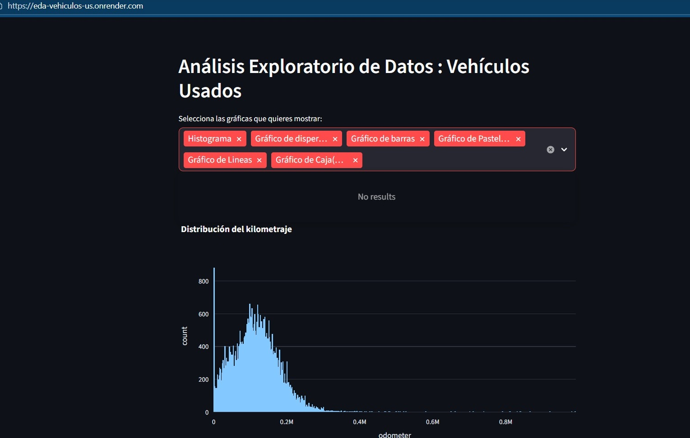
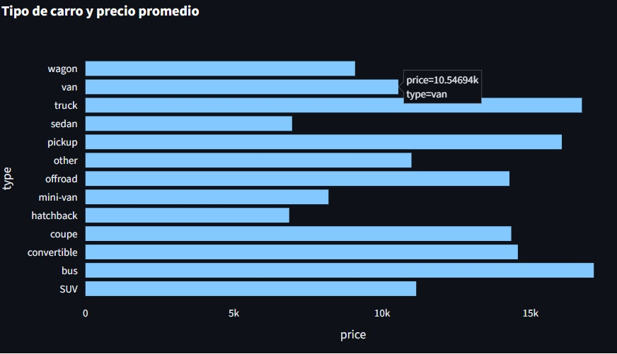
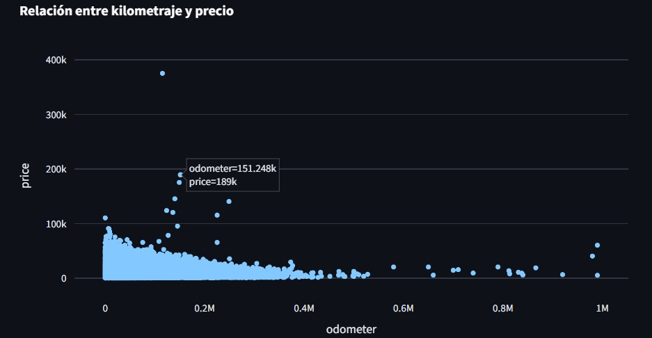
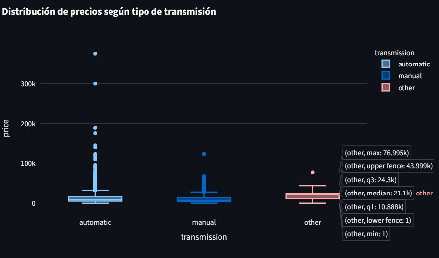

🚗📊 Análisis de Vehículos + App Web Interactiva

📌 Contexto
Análisis de un dataset de anuncios de vehículos usados para identificar patrones de mercado y comprender qué factores influyen en los precios y características de los vehículos publicados.Se desarrolló una aplicación web interactiva con Streamlit que permite explorar visualmente estos datos.

📁 Dataset principal: vehicles_us.csv contiene información como: Variables cuantitativas: price, model_year, odometer, cylinders, is_4wd, days_listed
                                                                 Variables categóricas: model, condition, fuel, transmission, type, paint_color
                                                                 Fecha de publicación del anuncio: date_posted
                                                                 
🎯 Objetivo
Analizar factores que influyen en el precio y las características de los vehículos.
Desarrollar una herramienta interactiva web que permita explorar los datos de manera dinámica y visual.

💻 Procesamiento de datos
Configuración y gestión de un entorno virtual de Python para garantizar reproducibilidad.
Limpieza y análisis exploratorio de datos (EDA).
Identificación de patrones en precios, año de modelo, kilometraje y tipo de vehículo.
Desarrollo de app web con Streamlit para exploración interactiva.
Visualizaciones dinámicas con Plotly Express.

🔎 Principales Hallazgos
Precios: Mayor variabilidad en vehículos más antiguos o con alto kilometraje.
Kilometraje y año del modelo: Relación clara con precio; vehículos recientes y con menos millas son más caros.
Tipo de vehículo y transmisión: Algunos tipos (SUV, Truck) y transmisiones automáticas presentan precios más altos.
4x4 y cilindrada: Vehículos 4x4 y con más cilindros tienden a estar en rangos de precio superiores.

📌 Recomendaciones / Impacto
La app permite a usuarios y analistas explorar datos dinámicamente para evaluar vehículos y patrones de mercado.
Puede usarse para identificar vehículos subvalorados o tendencias de precios.
Combina análisis de datos y desarrollo web, entregando una herramienta práctica para decisiones comerciales.

📈 Algunas Visualizaciones 

  

